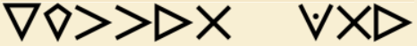

import Tabs from '@theme/Tabs';
import TabItem from '@theme/TabItem';
import PasswordForm from '@site/src/components/PasswordForm5';
import NameBanner from '@site/src/components/NameBanner';

# Fall 2025 Kickoff CTF
Welcome to the Fall 2025 Kickoff Capture The Flag competition! There are 15 questions across 10 challenges. Each question is worth 1 point.

*NOTE: Your correct answers are being saved and sent even if you refresh the page.*
<NameBanner />

## OSINT
### Challenge 1
**Debrief**: We've found this bug-like creature that you need to identify.

What game is this creature from?

<PasswordForm
  hash="438dd7b30ba42046a96806cb3c70372e98618f4dd987d6bc53b36fb57391a64a67f7cce641950249edf8c2f75b76a7a05c972030cf0866c87ce74fbc24788b7b"
  algorithm="sha512"
  challengeName="OSINT 1"
  points={1}
/>

What is this creature's name?
<PasswordForm
  hash="4cedc5bec8f9c78124b02a1278f72a9edaaee7d57ca46bc150972c562557421c3d58f05c71a96748db8168c9e2abe3a716aff11021edaabad0a635cc1f3b5864"
  algorithm="sha512"
  challengeName="OSINT 2"
  points={1}
/>

What was this creature's occupation while in this outfit?
<PasswordForm
  hash="542e5d741c8d644852a565f0cee72c15bee834694068257553aacba2c2141306a04c44d18466ac3477e8f3a56dbcc78a731526cad0a0b6dfef224c483b7bb712"
  algorithm="sha512"
  challengeName="OSINT 3"
  points={1}
/>

### Challenge 2
**Debrief**: We've found a suspicious link hiding something, see if you can figure it out.

Link: https://flag.thehackpack.org (yes, this link is not supposed to load)

What DNS record type holds the secret?
<PasswordForm
  hash="3db77fb1d2eee01c3738380f0bfd476388f2614b3e9bd2cb934856b2adeaeb64319e132ce215a30285c1452ef14b30322b5c39d9b220902442143d8dd63dc8da"
  algorithm="sha512"
  challengeName="OSINT 4"
  points={1}
/>

What is the flag?
<PasswordForm
  hash="4e9fa155d0aed83c07a760f009eb35faab49f0bf7e1b4cc53144b8b011680c8e57cb2f07918adbde1cc45651ff764047ba9f08403968062a03be8d0b56d0b839"
  algorithm="sha512"
  challengeName="OSINT 4"
  points={1}
/>

### Challenge 3
Debrief: We want you to figure out some details about the event(s) in the picture

[Image](./assets/vegas.jpg)

What year did the "Vegas Dawgs After Dark" happen?
<PasswordForm
  hash="8f4bb23c96ed98f11274ea70279d153949d84c134b092db2245d2caaec72f9849ba9eaadc0a60e68bce898c65d4a14e1a1cc256688158ebd4836ca43b8667956"
  algorithm="sha512"
  challengeName="OSINT 5"
  points={1}
/>

## Cryptography
Useful tools: 
- https://gchq.github.io/CyberChef/
- https://www.dcode.fr/cipher-identifier
### Challenge 4
Decode `124 110 120 173 145 162 155 137 167 150 141 164 137 164 150 145 137 163 151 147 155 141 175`
<PasswordForm
  hash="2b37b205f2938e6214423d59b6a95c6cb72553ac0da5a7b800f9621ca425cb38bfcb2ed6f40df41b591b53a2d28925b12a0cb257212c540a51d9c4654f19d1c7"
  algorithm="sha512"
  challengeName="Crypto 1"
  points={1}
/>

### Challenge 5
Decode `GSK{hsabta}`
<PasswordForm
  hash="b575211921d0c64c2f189ee5a25e70a687bd44cbc1acad3db59c90ab17c27ac6879ca8ca61c24bf86c7c0a88fd2d01b0c090f39e067b5c4f7326b9e318101988"
  algorithm="sha512"
  challengeName="Crypto 2"
  points={1}
/>

### Challenge 6
Decode `NjYgMzMgOSAwIDcgNDQgNjY2IDY2IDMzIDAgOSA0NCA2NjYgMCAzIDQ0NCA3Nzc3`
<PasswordForm
  hash="83b951fb26cd6f911cd928ed67f6877185282fd8e6e50a24d669582e700839a4c6b879cf64b49820164f09e52cfa4b0a5e212e22cb2c7abfb0cef24a404a8631"
  algorithm="sha512"
  challengeName="Crypto 3"
  points={1}
/>

### Challenge 7
Decode this symbol cipher:

<PasswordForm
  hash="99a0bc0ad2e717f3e7b6955367322297906e48a12923e86cb15b929a462a64dc60890aa6ffcec21ab94a4cffb570946356132f8a153dd0107c7d6446fa53b574"
  algorithm="sha512"
  challengeName="Crypto 4"
  points={1}
/>

## Steganography
### Challenge 8
This dog's picture seems to be hiding something.

[Image](./assets/dog.jpg)

What's the flag?
<PasswordForm
  hash="d95263f23e492bb9e12bf039e19e7697784ba6c82007b24b6c7d016261a80fba7496fa46347625263e0ea936ea8f20bbf87c5ca639699bdb766844d18a0491fd"
  algorithm="sha512"
  challengeName="Steg 1"
  points={1}
/>

### Challenge 9

This dog also seems to be hiding something.

[Image](./assets/dawg.jpg)

What's the flag?
<PasswordForm
  hash="1d027369cb8eddcfe7c8efca8f5a031117beb9c1e130d05d79be577837572843d1c3f40d351e2977b2b3eccfb1c9ff0f8fec0d179ca58d8e824aa1b736bc49af"
  algorithm="sha512"
  challengeName="Steg 2"
  points={1}
/>

## Web App Exploitation
### Challenge 10
We've found a website with 3 flags, can you find them?

[Access Website](https://thehackpack.org/CTF/webChallenge3/)

Flag 1:
<PasswordForm
  hash="179491cc408e3477ac3488fdcac2f22fe262ee9e50f642f6f4ef7c5f6c7d2c28ccb5c328d8ac4f6b749e21adc85265d432bbd1aada3cfc8d69bc8502017ab05e"
  algorithm="sha512"
  challengeName="Web 1"
  points={1}
/>

Flag 2:
<PasswordForm
  hash="328fc236c5f74d1e93d5bbf592cb6436e74086fd6bb9ce03864fe72de0e93cad3b44062dcca9ef165c613807a67e66e5d7414172770bdc2fa9dc20f991b2dbb5"
  algorithm="sha512"
  challengeName="Web 2"
  points={1}
/>

Flag 3:
<PasswordForm
  hash="65c22020746e905d95724256086b92d3fdbffa2110a5fbf8c285b7ec4d6f650195d82a9531266b78d3d3ea3edbc69cdd9041652ae5e3e117f97cb761d218c531"
  algorithm="sha512"
  challengeName="Web 3"
  points={1}
/>

## Credits

- Author(s): Divesh Gupta (legendile7)
