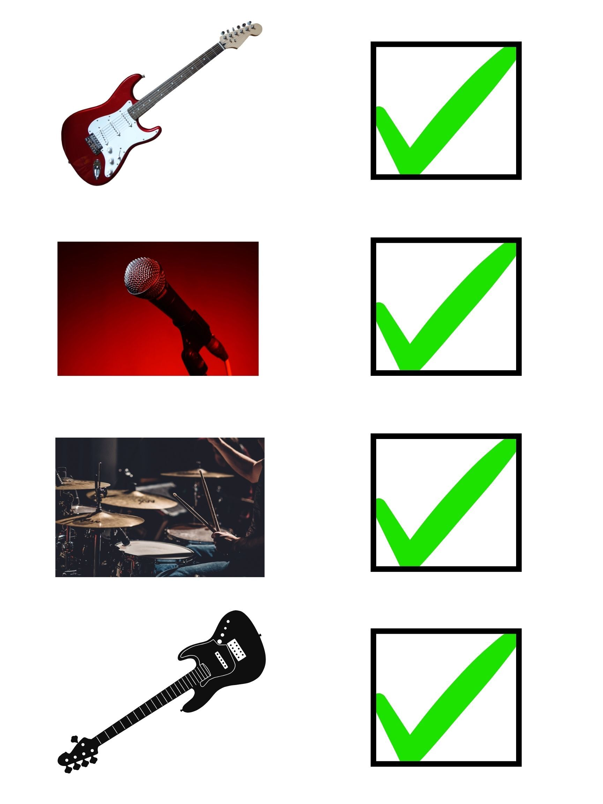

import PasswordForm from '@site/src/components/PasswordForm3';
import Tabs from '@theme/Tabs';
import TabItem from '@theme/TabItem';

# Checklist

Forensics | Hard - Checklist

## Challenge

Linkin Park are back in action! The sound tech has sent you a list of essential equipment. Make sure that the band has everything they need! (Please wrap your answer like such: scs\{answer\})

 

:::tip hint
<b> Binwalk can be used on Compressed archives (ZIP, TAR, JAR, etc.), JPEGs, and PDFs. Can you think of a browser based solution that runs steg tools like ‘binwalk’ for you?.</b>
:::

Q1 - 60 points  
What is the name of the .wav file (add the extension to the answer) ?
<PasswordForm 
    hash="6b53e99e27e2efb978bcea0ff2c1a153b65e5ddfff9a5a5dce8f3ae4bad67238022253ab2489b0affb61daaa6793d433f041b6a3b8c0c013f0aae6c13b7c2f0b"
    algorithm="sha512"
/>

Q2 - 30 points  
What is the most common file format that allows for file extraction?
<PasswordForm 
    hash="e41ec0cc255524939787350a1b54229d9d0ae00262232991ff0216ec5ca71d0b68bbec8331adda344ddbff9547d0e96615cd0d4e6957a70f7a3af5e4df6059a2"
    algorithm="sha512"
/>

Q3 - 10 points  
What is the hidden message?
<PasswordForm 
    hash="4b284107b9c2f1ab0124829735c4abff4333d97752347968830cc630763d1487864f4e87207c82b5841fb714d09789521c50f858fabcd94899b2f164d7964a58"
    algorithm="sha512"
    googleFormUrl="https://docs.google.com/forms/d/e/1FAIpQLSeA9TannDqHzYz3hx49w9mxgm2Wr_HWr_k28X3OgwltWC7c3w/formResponse"
    entryId="entry.1238142575"
/>

## Solution

    
Solution Guide

    1. What is the name of the .wav file (add the extension to the answer)?
       1. Figure out that .jpeg is a supported file type for steganography
       2. Use ‘binwalk checklist.jpeg’ to view the contents inside of the file
       <!--3. <b>scs\{dj.wav\}</b>-->
    2. What is the most common file format that allows for file extraction?
       1. Look this up
       <!--2. <b>scs\{zip\}</b>-->
    3. What is the hidden message (lowercase)?
       1. Copy the file from .jpeg to .zip format ‘cp checklist.jpeg check.zip’
       2. Unzip the compressed file to extract its contents ‘unzip check.zip’
       3. Take the extracted dj.wav file and plug it into this morse code to english translator
       <!--4. scs\{t4rn t&bl3s\}-->

## Credits

- Author(s): Swapnil Roy (thespcrewroy)
