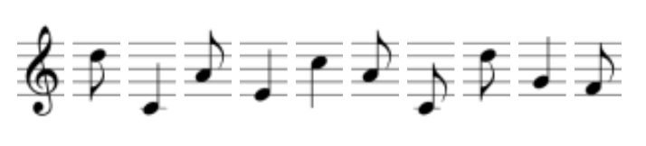

import PasswordForm from '@site/src/components/PasswordForm3';
import Tabs from '@theme/Tabs';
import TabItem from '@theme/TabItem';

# Musical Chairs

Cryptography | Easy - Musical Chairs

## Challenge

Help! I can’t find my friend Jimi! Why does he always do this? He left me a song, but I don’t know what it means. Do you? (Please wrap your answer like such: scs\{answer\})

:::tip hint
<b>What site has access to a plethora of cipher decoders?</b>
:::

Q1 - 100 points  
Where is Jimi?
<PasswordForm 
    hash="e3637246ab2b612c3ea9dae64710f07a56079868828476b6106e504ee9af2a484d30310991887e0a0889a9fd33d0a3f6e7fba5580764214ae0cb08ccb6c7b540"
    algorithm="sha512"
    googleFormUrl="https://docs.google.com/forms/d/e/1FAIpQLSdNyA9p6HMUNiBSt_ppqolPaOZxQm9UEZ2QslxJoRnEJTtjFA/formResponse"
    entryId="entry.618474535"
/>

## Solution

    
Solution Guide

    1. Go to [dcode.xyz - music sheet cipher](https://www.dcode.fr/music-sheet-cipher)
    2. Enter in the musical notes and hit ‘decode’
    <!--3. <b>scs\{WATCHTOWER\}</b>-->

## Credits

- Author(s): Swapnil Roy (thespcrewroy)
