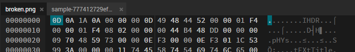
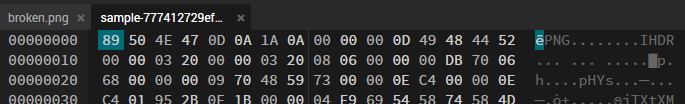

import PasswordForm from '@site/src/components/PasswordForm';
import Tabs from '@theme/Tabs';
import TabItem from '@theme/TabItem';

# Easy - Broken
Forensics | Easy - Broken
## Challenge
We have intercepted a dank meme. Unfortunately, it seems to be corrupted. Can you fix it?

Download file: <a href={require('@site/static/assets/broken.png').default} download>broken.png</a>

<PasswordForm hash="b1df31cc3e723b6f6fe2b030fe6642534b1540fc2baff262cf4d1c30812f89ce2d5e5fc5ad2150a3aaa4e3bb901d11a6fdd7c43bedce5354be55748f951ff960" algorithm="sha512" />

## Solution

  
Solution Guide

  
  You might have noticed that the image does not open. Let's open the image in a hex editor to see what's going on. A good online hex editor is https://hexed.it/. Upon opening the image, we can see the hexadecimal values as well as utf-8 (plaintext). The best way to see what's wrong with a corrupted file is by comparing it with another similar file. Let's open any non-corrupted PNG image in Hexedit (<a href={require('@site/static/assets/sample.png').default} download>**here**</a>'s an image you can use).

  Upon comparing the two files, you should immediately see a difference at the very beginning of the file. Here's what it looks like for each image:
  <Tabs>
  <TabItem value="corrupted" label="Corrupted Image" default>
    
  </TabItem>
  <TabItem value="sample" label="Sample Image">
    
  </TabItem>
  </Tabs>
  

  The sample image beings with `89 50 4E 47` (utf-8: `ëPNG`) whereas the corrupted image is missing it! This is the PNG file header. It is essential for an image rendering software to identify the image type and render it. Our corrupted image is missing this header, so let's add it. We can do this in Hexedit by **Right Clicking the first hex byte > Insert Bytes Here > 4 Bytes**. Then, we manually type the header stated above. We should be able to **Save as** to a new image and it should now open, giving you the flag!

