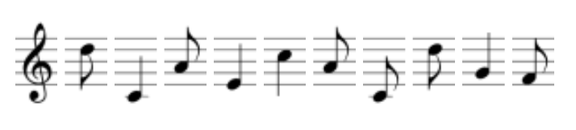

import PasswordForm from '@site/src/components/PasswordForm';
import Tabs from '@theme/Tabs';
import TabItem from '@theme/TabItem';

# Musical Chairs

Cryptography | Easy - Musical Chairs

## Challenge

Help! I can’t find my friend Jimi! Why does he always do this? He left me a song, but I don’t know what it means. Do you? (Please wrap all solutions within a ‘scs{}’ wrapper)

:::tip <b>What site has access to a plethora of cipher decoders?</b>
:::

Q1 - 100 points  
Where is Jimi? (ALL CAPS)
<PasswordForm hash="8f4d1e4c64ca90d9689d96b49002dd7e47398ca4bbb5e7ca0640db9fed1948bb46f4c4d29fb36c21eb26e0cb2ed36d82b990dca283a5be864befef2aabfe011b" algorithm="sha512" />

<!--
## Solution

    
Solution Guide

    1. Go to [dcode.xyz - music sheet cipher](https://www.dcode.fr/music-sheet-cipher)
    2. Enter in the musical notes and hit ‘decode’
    3. <b>scs\{WATCHTOWER\}</b>

-->

## Credits

- Author(s): Swapnil Roy (thespcrewroy)
