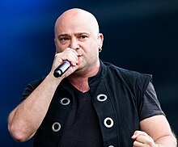

import PasswordForm from '@site/src/components/PasswordForm';
import Tabs from '@theme/Tabs';
import TabItem from '@theme/TabItem';

# Nu Hair

OSINT | Easy - Nu Hair

## Challenge

Remember when being bald was cool? (Please wrap all solutions within a ‘scs{}’ wrapper)

Q1 - 100 Points  
What band is this vocalist a part of?
<PasswordForm hash="5ede5c568ddbf0d82ea9cd24f86fc8122ecb0d8bcd66cdb11a3405c79dd6fd392c325e52821c4872d55753f57587dd6ff066128168107f39c35d3d97d0f644b6" algorithm="sha512" />

<!--
## Solution

    
Solution Guide

    1. Reverse image search leads to wikipedia page: [David Draiman - Wikipedia](https://en.wikipedia.org/wiki/David_Draiman)
    2. You can also use ChatGPT Premium to input in the image
    3. <b>scs\{Disturbed\}</b>

-->

## Credits

- Author(s): Divesh Gupta (legendile7)
